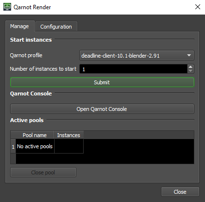

# qarnot-render-deadline

The Qarnot integration for [Deadline](https://www.awsthinkbox.com/deadline), based on a python module + a Deadline Monitor UI script:

* The Deadline Monitor UI script `QarnotRender` can be found in the `Scripts` menu:

  

* The python module `qarnot_render_deadline` can be used this way:

  ```python
  import qarnot_render_deadline

  q_render_deadline = qarnot_render_deadline.QarnotRenderDeadline(
      client_token="YOUR_API_TOKEN", cluster_url="https://api.qarnot.com"
  )
  q_render_deadline.create_instances("deadline-client", 2)
  # Deadline workers will appear in Deadline Monitor once the task is fully
  # dispatched. You can then launch Deadline jobs against those machines
  # and, once you're done, shut the workers down with:
  q_render_deadline.stop_instances()
  ```

It has been tested with Deadline v10.3.2.1 and deadline 10.1.3.6. but except breaking changes, it should work with your version too.

Please note that since **Deadline 10.3.0.9, python 2 is no more supported.** and python 3 is used by defaults since 10.1.19.4.

## Installation

#### 1. Python module and dependencies

The file [qarnot_render_deadline.py](qarnot_render_deadline.py) must be manually copied on the machine running the Deadline Monitor to:

* on Linux:
```
# Python 3.10
/opt/Thinkbox/Deadline10/lib/python3/lib/python3.10/site-packages/qarnot_render_deadline.py

# Python 2.7
/opt/Thinkbox/Deadline10/lib/python2.7/site-packages/qarnot_render_deadline.py

```

* on Windows (**Warning**: if you download the RAW file from github, make sure that the extension ".txt" was not added to the python file and remove it if needed):
```
C:\Program Files\Thinkbox\Deadline10\bin\Lib\site-packages\qarnot_render_deadline.py
```

#### 2. `qarnot` module

   * on Linux:
   ```bash
  # Update Qarnot Python SDK to the python version used by Deadline
  # If git is not installed, use "https://github.com/qarnot/qarnot-sdk-python/archive/refs/heads/master.zip"
  # instead, like on Windows (see below)

  # Python 3.10
  pip install -U --target \
  /opt/Thinkbox/Deadline10/lib/python3/lib/python3.10/site-packages/ \
  git+https://github.com/qarnot/qarnot-sdk-python.git

  # Python 2.7 
  pip install -U --target \
  /opt/Thinkbox/Deadline10/lib/python2.7/site-packages \
  git+https://github.com/qarnot/qarnot-sdk-python-27.git

   ```

   * on Windows:
   ```powershell
   # Update Qarnot Python SDK to the python 3.10 version (used by Deadline)
   py -m pip install -U --target "C:\Program Files\Thinkbox\Deadline10\bin\Lib\site-packages" "https://github.com/qarnot/qarnot-sdk-python/archive/refs/heads/master.zip"
   ```
#### 3. Deadline Monitor UI script

The file [custom/scripts/General/QarnotRender.py](custom/scripts/General/QarnotRender.py) must be copied in the Deadline repository's `custom` directory:

```
<repo_path>/custom/scripts/General/QarnotRender.py
```

## Configuration

The `qarnot_render_deadline.py` module has a `CONFIGURATION` section at the beginning of the file that needs to be filled:

```python
######## CONFIGURATION #########################################################
self.license_server = ""
self.license_mode = "Standard"
# Your Deadline Remote Connection Server (RCS) in the form "hostname:port"
self.repository = ""
# Path to your "Deadline10RemoteClient.pfx" file
self.proxy_crt = r""
# The optional certificate password
self.proxy_crt_pwd = ""
self.proxy_ssl = "True"
######## CONFIGURATION #########################################################
```

Please note that `qarnot_render_deadline.py` is only read at startup so **you need to relaunch Deadline Monitor after modifying the configuration**.

The configuration is done manually in `qdeadline.py` for now but all those options will eventually be exposed in the Deadline Monitor UI.

## Use a specific renderer

### Change image by changing `DOCKER_TAG`

For a selected profile, you can choose an older image with the `DOCKER_TAG` constant. By default, `DOCKER_TAG` tag is set to latest.

Available tags by profiles
* **Deadline-client**
  * `deadline-10.3.2.1-ubuntu`
* **Deadline-client-blender**
  * `deadline-10.3.2.1-blender-4.1.1`
* **deadline-client-vray-standalone**
  * `deadline-10.3.2.1-vray-62006`
* **deadline-client-vray-standalone-byol**
  * `deadline-10.3.2.1-vray-62006`

Example :
```
task.constant["DOCKER_TAG"] = "deadline-10.3.2.1-blender-4.1.1"
```

### Upgrade image by importing software in your bucket

You use a lot of plugins or your renderer isn't is the list above? No problem, you can create a bucket and upload your software in it in order to run it from Deadline. Please see below some documentations about Qarnot buckets.


## Data access
#### TASK_PATH
The task's data are available in the environement variable `TASK_PATH` (which equals `/job` by default).

If your renderer/DCC supports environment variables, it is better to use `TASK_PATH` directly. Though, most of the time this is not the case, so you can also use `/job` directly. And if you need this path to be renamed to a custom value (like `/work` or `/prod`, etc) to match your on-premise setup, please contact the support team through the chat present in the [Qarnot Console](https://console.qarnot.com/)).

Data written to `TASK_PATH` are uploaded to the output bucket every 5 minutes and when the task is aborted. It's specified at `line 179` with a [snapshot](https://qarnot.com/documentation/sdk-python/api/compute/task.html#qarnot.task.Task.snapshot)

#### Buckets

The output bucket of the task is defined `line 149` and the input bucket just  at `line 150`. 
- You can [name them](https://qarnot.com/documentation/sdk-python/api/connection.html#qarnot.connection.Connection.retrieve_or_create_bucket) the way you need. 
- And specifically for the input buckets, you can [fill it before it start](https://qarnot.com/documentation/sdk-python/api/compute/task.html#qarnot.task.Task.resources) or [update it while it's running](https://qarnot.com/documentation/sdk-python/api/compute/task.html#qarnot.task.Task.update_resources)

Here is some S3 data managment softwares [documentation](https://qarnot.com/documentation/en/managing-your-data/with-any-s3-compatible-software/on-windows) in order for you to populate or retrieve your data from your buckets.


## Vray  
<details>
  <summary> See more about vray usage with deadline on Qarnot </summary>

### Vray Standalone Debug
If you encounter this kind of error: `Error: [Errno 21] Is a directory:`, it's possibly path mapping related. You can disable it in `Tools>ConfigurePlugins>Vray>PathMapping For Vrscene`, or tweak the deadline plugin to suit your needs.

> **_NOTE:_** :  V-Ray File location setting while submitting has to mock Qaarnot architecture and be in the `/job` directory e.g. `/job/vases/vases.vrscene` . 

### Licenses
Vray license IP and Port has to be set in an xml file like this one : `deadline-input/vrlclient.xml`. 
This file has to be in `/job/` to be recognize. Thus, upload it to a bucket and attach it to your task like below:

``` python
input_bucket = self.conn.create_bucket('deadline-input')
input_bucket.sync_directory("deadline-input")
task.resources.append(input_bucket)
```

#### BYOL
Need to do **B**ring **Y**our **O**wn **L**icense for VRay? Just select `deadline-client-vray-standalone-byol` as profile and change IP and Port to yours in `vrlclient.xml`.

#### License On Demand
You need license for Vray? Do not change IP and Port in `vrlclient.xml` and use `deadline-client-vray-standalone` profile.
</details>
