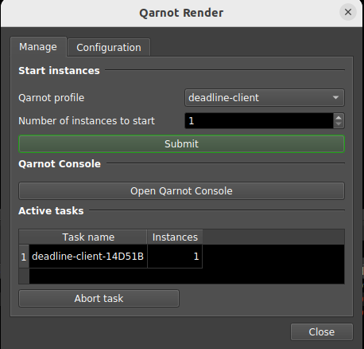

# qarnot-render-deadline

The Qarnot integration for [Deadline](https://www.awsthinkbox.com/deadline), based on a python module + a Deadline Monitor UI script:

* The Deadline Monitor UI script `QarnotRender` can be found in the `Scripts` menu:

  

* The python module `qarnot_render_deadline` can be used this way:

  ```python
  import qarnot_render_deadline

  q_render_deadline = qarnot_render_deadline.QarnotRenderDeadline(
      client_token="YOUR_API_TOKEN", cluster_url="https://api.qarnot.com"
  )
  q_render_deadline.create_instances("deadline-client-10.1-blender-2.91", 2)
  # Deadline workers will appear in Deadline Monitor once the pool and task is
  # fully dispatched. You can then launch Deadline jobs against those machines
  # and, once you're done, shut the workers down with:
  q_render_deadline.stop_instances()
  ```

It has been tested with Deadline v10.1.3.6 but should work with any Deadline version.

## Installation

 * python module and dependencies

   The file [qarnot_render_deadline.py](qarnot_render_deadline.py) must be manually copied on the machine running the Deadline Monitor to:

   * on Linux:
   ```
   /opt/Thinkbox/Deadline10/lib/python2.7/site-packages/qarnot_render_deadline.py
   ```

   * on Windows (**Warning**: if you download the RAW file from github, make sure that the extension ".txt" was not added to the python file and remove it if needed):
   ```
   C:\Program Files\Thinkbox\Deadline10\bin\Lib\site-packages\qarnot_render_deadline.py
   ```

   The `qarnot` module also has to be installed with:

   * on Linux:
   ```bash
   pip install --target /opt/Thinkbox/Deadline10/lib/python2.7/site-packages 'qarnot==2.3.1'
   ```

   * on Windows:
   ```powershell
   py -m pip install --target 'C:\Program Files\Thinkbox\Deadline10\bin\Lib\site-packages' 'qarnot==2.3.1'
   ```
 * Deadline Monitor UI script

   The file [custom/scripts/General/QarnotRender.py](custom/scripts/General/QarnotRender.py) must be copied in the Deadline repository's `custom` directory:

   ```
   <repo_path>/custom/scripts/General/QarnotRender.py
   ```

## Configuration

The `qarnot_render_deadline.py` module has a `CONFIGURATION` section at the beginning of the file that needs to be filled:

```python
######## CONFIGURATION #########################################################
self.license_server = ""
self.license_mode = "Standard"
# Your Deadline Remote Connection Server (RCS) in the form "hostname:port"
self.repository = ""
# Path to your "Deadline10RemoteClient.pfx" file
self.proxy_crt = r""
# The optional certificate password
self.proxy_crt_pwd = ""
self.proxy_ssl = "True"
######## CONFIGURATION #########################################################
```

Please note that `qarnot_render_deadline.py` is only read at startup so **you need to relaunch Deadline Monitor after modifying the configuration**.

The configuration is done manually in `qdeadline.py` for now but all those options will eventually be exposed in the Deadline Monitor UI.
